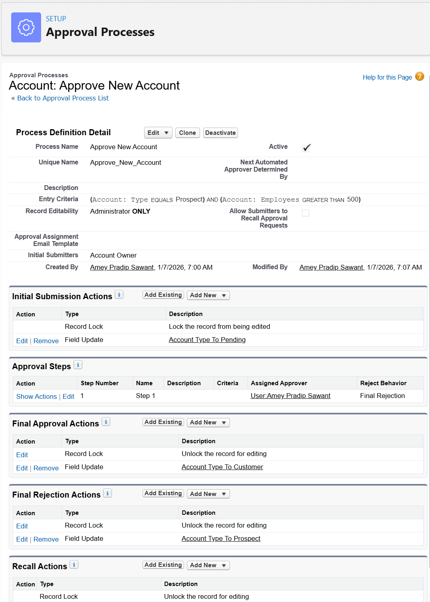

# Approve Records with Approval Processes

## Customize How Records Get Approved

An approval process automates how Salesforce records are approved. In an approval process, you specify:

- The steps necessary for a record to be approved and who approves it at each step.
- The actions to take based on what happens during the approval process.

## Build an Approval Process

Set up email templates, custom fields, and an approval process for discounted opportunities.  
Automate submissions with Flow Builder or a button, ensuring smooth approval workflows.

### Challenge: Create an Approval Process

#### Skills Demonstrated
- **Approval Process Configuration**
- **Account Lifecycle Governance**
- **Entry Criteria Logic**
- **Field Update Actions**
- **Record Locking and Unlocking**
- **Picklist Value Management**
- **Process Automation Controls**

#### Challenge Completion Proof
- ✅ **Account picklist values verified and updated** (Prospect, Pending, Customer)  
- ✅ **Approval process created** using Jump Start Wizard  
- ✅ **Entry criteria enforced** for high-employee Prospect accounts  
- ✅ **Automatic approver assignment configured**  
- ✅ **Initial submission action** sets Account Type to *Pending*  
- ✅ **Final approval actions** convert Account to *Customer* and unlock record  
- ✅ **Final rejection action** reverts Account Type to *Prospect*  
- ✅ **Approval process activated successfully**  
- 📸 **Screenshots captured**: Entry criteria, approval actions, active process status

    