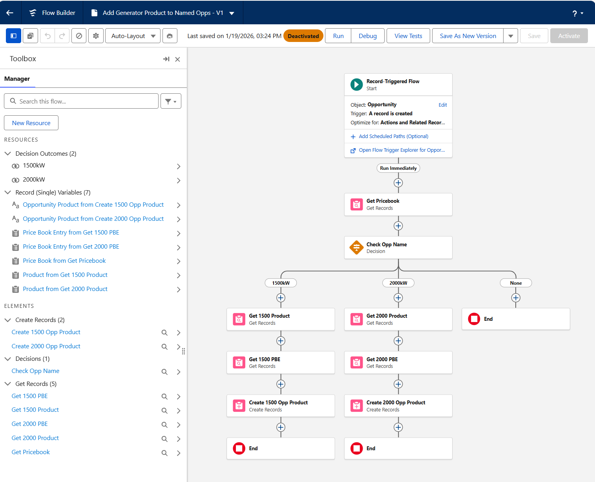
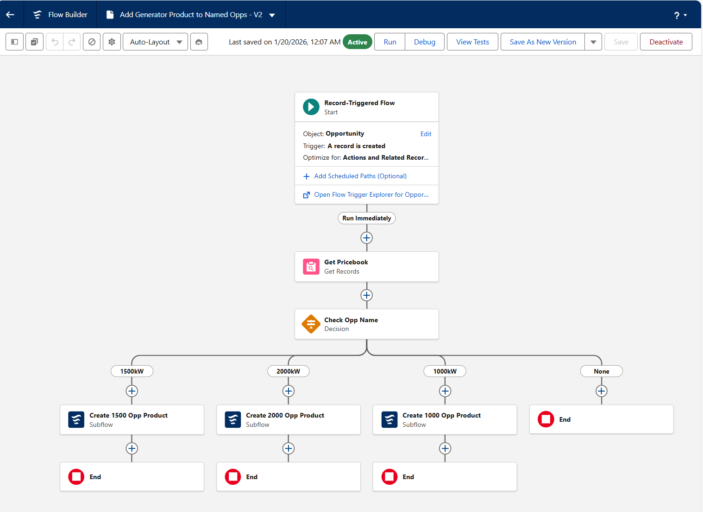
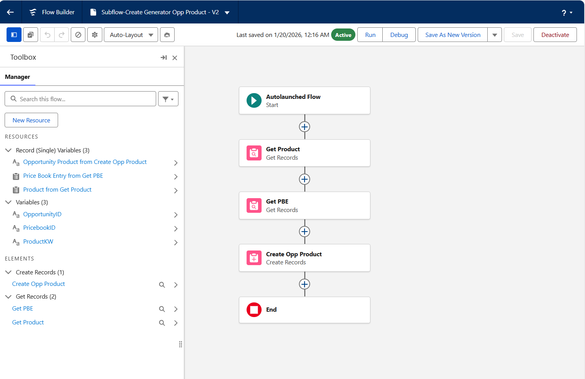

# Flow Builder Logic

## Define Multiple Paths in a Flow

### Introduction to Branching Logic
This unit explains how to use Flow Builder to create automation with branching paths, similar to train tracks that split and merge. It introduces the concept of using a Decision element to handle different outcomes based on conditions, such as setting case priorities based on issue type and requester influence.

### Visualizing Business Requirements
The unit emphasizes the importance of translating business requirements into a flowchart. It provides an example where different case types and requester statuses determine the priority level. The flowchart is then used to design a flow with multiple outcomes, each representing a specific condition.

### Building a Decision Element
The Decision element is the core of branching logic in Flow Builder. You learn to create outcomes for each condition, define their requirements, and set a default outcome for unmatched cases. The unit walks through configuring these outcomes and their conditions step-by-step.

### Adding Update Records Elements
To complete the flow, Update Records elements are added to each path to set the appropriate priority value. The unit also covers saving, activating, and testing the flow to ensure it works as intended.

### Challenge: Use a Decision Element to Make Multiple Paths

#### Skills Demonstrated
- **Record-Triggered Flows**
- **Decision Elements**
- **Multi-Path Flow Logic**
- **Get Records Configuration**
- **Price Book and Product Modeling**
- **Opportunity Product Automation**
- **Cross-Object Data Mapping**

#### Challenge Completion Proof
- ✅ **Record-triggered flow created** on Opportunity creation  
- ✅ **Standard Price Book retrieved** dynamically via Get Records  
- ✅ **Decision logic implemented** based on Opportunity Name values  
- ✅ **Multiple flow paths configured** for 1500kW and 2000kW scenarios  
- ✅ **Product and Price Book Entry records retrieved** per path  
- ✅ **Opportunity Products created automatically** with correct pricing  
- ✅ **Flow saved and activated** (`Add_Generator_Product_to_Named_Opps`)  
- 📸 **Screenshots captured**: Decision logic, Get Records chaining, Opportunity Product creation

    

## Set and Change Variable Values
### The Power of Change
This section explains how data in a flow often needs to be modified. For example, a flow might retrieve record data, modify it, and then update the record. A scenario is presented where users decide whether to copy a billing address to a shipping address or manually enter a new one. A variable is used as an intermediate storage to handle data from either source, and a Decision element determines the user's choice.

### The Assignment Element
The Assignment element is introduced as a tool to assign values to variables. Variables are compared to lunchboxes that can store various values. The element allows you to set, replace, or combine values using operators. For example, you can assign a priority level to a variable or mix text with existing resources in the flow.

### Build a Flow with Assignment Elements
This section walks through creating a screen flow to manage shipping addresses. It includes steps to create a text variable, retrieve account data, prompt users for input, and use Decision and Assignment elements to handle different paths. The flow updates the shipping address fields based on user input or the billing address.

### Update the Account Record
Finally, an Update Records element is used to save the modified shipping address back to the account record. The flow combines five elements: Get Records, Screen, Decision, Assignment, and Update Records, demonstrating how they work together to automate processes.

## Run a Flow Within a Flow

### The Power of Laziness
Instead of duplicating work across multiple flows, you can create a single "child flow" and reference it in multiple "parent flows." This reduces errors and simplifies updates, as changes only need to be made in the child flow.

### Input and Output Variables
Child flows use special variables marked as "Available for input" or "Available for output." These allow data to pass between the parent and child flows. For example, a parent flow can send a record ID to a child flow, and the child flow can return a Chatter post ID back to the parent flow.

### Create a Subflow Element
To use a Subflow, you first create a child flow (e.g., an autolaunched flow) with input and output variables. Then, you add a Subflow element to the parent flow, configure it to reference the child flow, and map the necessary variables. This setup ensures seamless data exchange and automation.

### Considerations
When working with Subflows, remember that they can only reference autolaunched or screen flows. Additionally, inactive flows run only for users with the "Manage Flows" permission, and parent flows always use the active version of a child flow.

### Challenge: Simplify and Build Upon the Opportunity Product Flow

#### Skills Demonstrated
- **Autolaunched Flows**
- **Subflows**
- **Reusable Flow Design**
- **Flow Modularity**
- **Decision Element Enhancements**
- **Opportunity Product Automation**
- **Price Book and Product Mapping**

#### Challenge Completion Proof
- ✅ **Reusable autolaunched subflow created** for Opportunity Product creation  
- ✅ **Input variables configured** to support dynamic product selection  
- ✅ **Product and Price Book Entry retrieval abstracted** into the subflow  
- ✅ **Parent flow simplified** by replacing repeated elements with subflow calls  
- ✅ **Existing product paths refactored** to use the subflow (1500kW, 2000kW)  
- ✅ **New Decision outcome added** for 1000kW product path  
- ✅ **Additional product path implemented** using the same subflow  
- ✅ **Flows saved and activated successfully**  
- 📸 **Screenshots captured**: Subflow design, parent flow refactor, Decision logic with added outcome

    
     
     
    

##  Route and Reorder Flow Elements

### Power-Up Decisions with Custom Permissions
By combining this variable with the Decision element, you can create flows that branch based on user permissions. For example, you can show specific screens to users with certain permissions and guide others differently.

### Make a Long-Distance Connection
Flow Builder allows you to create nonlinear connections using Go To Connectors. These connectors help keep your flow canvas organized and prevent clutter. However, be cautious of creating infinite loops, as they can cause errors. Test your flows thoroughly to avoid exceeding Salesforce limits.

### Move Your Elements Here, There, and Everywhere
You can move elements on the flow canvas by cutting and pasting them. Auto-Layout is the recommended mode for building flows, but Free-Form mode can be useful for moving multiple elements. Adjust connectors as needed to ensure your flow runs smoothly.