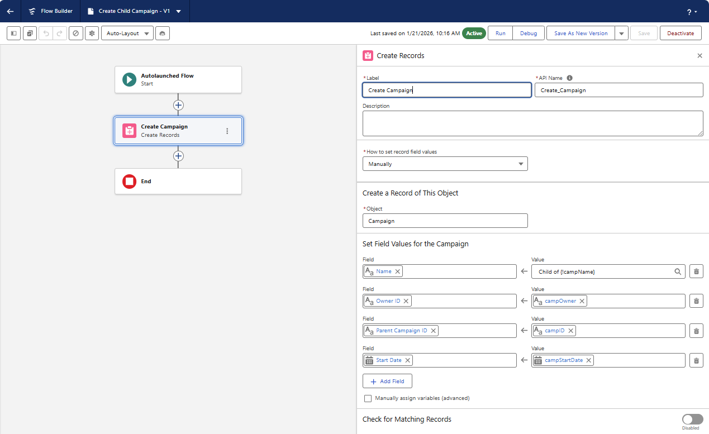
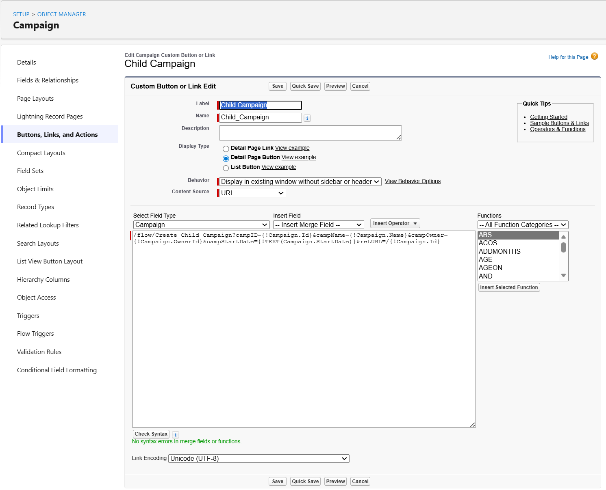
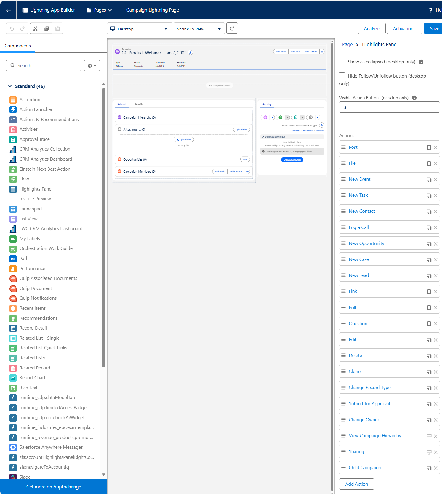
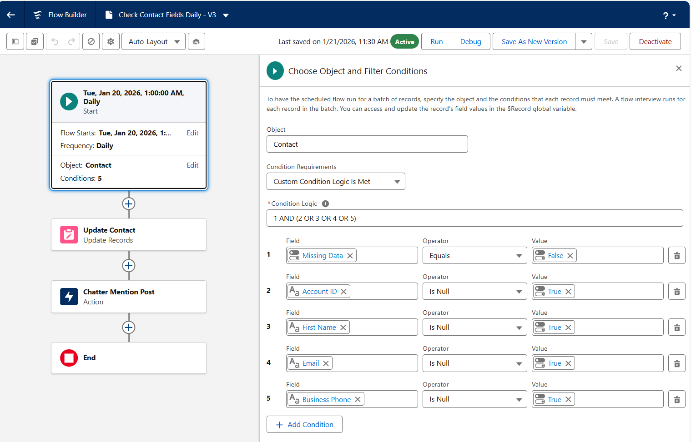

# Autolaunched and Scheduled Flows

## Get Started with Autolaunched Flows

### Autolaunched Flows Overview

Autolaunched flows are background processes that run without user interaction. Unlike other flow types, they are not triggered by schedules, record changes, or platform events, giving you more control over when they run. They are ideal for automations that need to be initiated manually or by external mechanisms.

### Running Autolaunched Flows

You can run Autolaunched flows using various mechanisms, such as custom buttons, Einstein AI conversations, subflows, or other automation tools like Apex code or API calls. These flows are versatile and can be triggered based on user judgment or external events.

### Identifying Autolaunched Flows

To find Autolaunched flows, use the All Flows list view in the Automation app or the Flows page in Setup. In Setup, adding the Trigger field to the list view helps differentiate true Autolaunched flows from other types like record-triggered or schedule-triggered flows.

### Key Features

Autolaunched flows are unique because they run without triggers or user interaction. They are perfect for scenarios where automation needs to be initiated manually or by external systems, making them a powerful tool in Salesforce automation.

## Build an Autolaunched Flow

### Automation That Runs with a Single Click

This unit introduces a scenario where support technicians need a way to clone specific details from closed cases without copying unnecessary information. The solution involves creating an autolaunched flow and a custom button to initiate it. This approach allows users to decide when to clone a case while automating the process of copying only the required fields.

### Create an Autolaunched Flow with Input Variables

To build the flow, you first identify the fields to clone (e.g., ID, Subject, Account ID, and Type). Then, you create input variables in the flow to pass these values. The flow includes a "Create Records" element to clone the case and a custom field to link the new case to the original one.

### Get the URL for the Flow

Once the flow is built, you retrieve its relative URL from the Flow Details page in Salesforce Setup. This URL is essential for creating a custom button that runs the flow.

### Create a Custom Button to Run the Flow

The final step is to create a custom button on the Case object. This button is configured to run the flow using its URL. While the button can launch the flow, additional steps are needed to pass record-specific information to the flow, which is covered in the next unit.

### Challenge: Create a Child Campaign Flow

#### Skills Demonstrated

- **Salesforce Flow Builder**
- **Autolaunched Flows**
- **Flow Input Variables**
- **Create Records Element**
- **Campaign Object Automation**
- **Parent–Child Campaign Relationships**

#### Challenge Completion Proof

- ✅ **Autolaunched Flow** created with external input variables
- ✅ **Parent Campaign data** passed into the flow (`campID`, `campName`, `campOwner`, `campStartDate`)
- ✅ **Campaign record created dynamically** using Create Records
- ✅ **Hierarchy established** via Parent Campaign ID mapping
- ✅ **Flow activated** and ready for external invocation
- 📸 **Screenshots captured** below -

  

## Run an Autolaunched Flow from a Custom Button

### Assign Values to Input Variables

To send data from a record to a flow, you assign values to input variables in the flow's URL. This involves pairing record field values with input variables using the format variable = {!Field}.  
For example, caseId={!URL_Redacted} assigns the Case ID to the caseId variable.

### Add URL Parameters to a Custom Button’s URL

URL parameters are added to the flow's URL to pass data. Parameters start with a ? and are separated by &. For example, /flow/Clone_Closed_Case?caseId={!URL_Redacted}&caseSubject={!Case.Subject} sends multiple values to the flow. A retURL parameter can also be added to define the page users return to after the flow finishes.

### Place the Custom Button

The custom button is added to a Lightning record page using Dynamic Actions. This involves upgrading the Highlights Panel to Dynamic Actions in the Lightning App Builder, adding the button, and activating the page. Dynamic Actions replace classic page layouts for button placement on Lightning pages.

### Challenge: Run a Flow from a Custom Button

#### Skills Demonstrated

- **Salesforce Flow Invocation**
- **Custom Button Configuration**
- **Flow URL Parameters**
- **Lightning Record Pages**
- **Dynamic Actions**
- **Campaign Object Customization**

#### Challenge Completion Proof

- ✅ **Custom Detail Page Button** created on Campaign object
- ✅ **Autolaunched Flow invoked via relative URL**
- ✅ **Flow input variables mapped** using merge fields (`campID`, `campName`, `campOwner`, `campStartDate`)
- ✅ **Date formatted correctly** using `TEXT(Campaign.StartDate)`
- ✅ **retURL configured** to return to the Campaign record
- ✅ **Lightning Record Page created and activated** as org default
- ✅ **Dynamic Actions enabled** and Child Campaign action added
- 📸 **Screenshots captured**: Custom button setup, URL parameters, Dynamic Actions configuration, Activated Lightning page

    
     
     
    

## Schedule a Flow

### Schedule-Triggered Flows vs. Scheduled Paths

Schedule-triggered flows run automation at specific times, independent of record changes, unlike scheduled paths that depend on record creation, updates, or deletions. These flows are part of the Autolaunched Flow family and can run once, daily, or weekly, making them ideal for tasks like data maintenance or sending reminders.

### Why Use Schedule-Triggered Flows?

These flows are perfect for automating repetitive tasks, such as escalating overdue cases, reminding users to fill in missing data, or pushing batch updates. They differ from scheduled paths by running at fixed times and processing multiple records simultaneously, making them efficient for large-scale operations.

### Before You Start

Before creating a schedule-triggered flow, ensure the following settings are configured: Default Workflow User, Automated Process User Email Address, and Default Time Zone. These settings ensure the flow runs smoothly and sends notifications correctly.

### Building and Using Schedule-Triggered Flows

To create a schedule-triggered flow, define the schedule, set criteria for records to process, and use the $Record global variable to handle batches of records efficiently. This approach is useful for tasks like posting Chatter alerts for accounts without contacts or recording daily metrics.

### Challenge: Create Automation that Regularly Checks Contact Data Quality

#### Skills Demonstrated

- **Schedule-Triggered Flows**
- **Contact Data Quality Automation**
- **Custom Field Configuration**
- **Flow Condition Logic**
- **Update Records Element**
- **Chatter Integration**
- **Owner Mentions via Flow**

#### Challenge Completion Proof

- ✅ **Custom Checkbox Field** (`Missing_Data`) created on Contact
- ✅ **Schedule-triggered flow** configured to run daily at 1:00 AM
- ✅ **Advanced condition logic applied** to detect incomplete Contact records
- ✅ **Contact records updated** using `$Record` global variable
- ✅ **Missing Data flag set** automatically when requirements not met
- ✅ **Chatter post created** on Contact record mentioning the Contact Owner
- ✅ **Flow activated** (`Check Contact Fields Daily`)
- 📸 **Screenshots captured**: Schedule configuration, condition logic, Update Records, Chatter action

    
