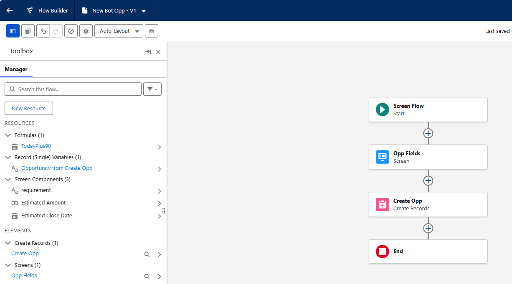
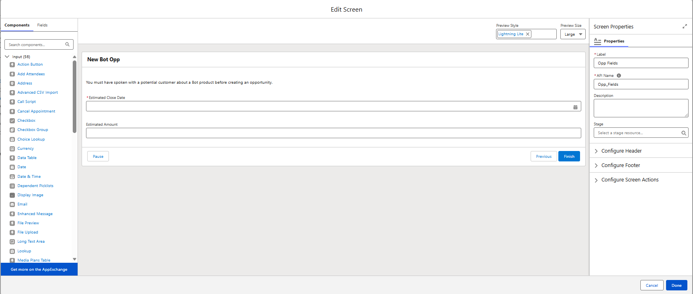
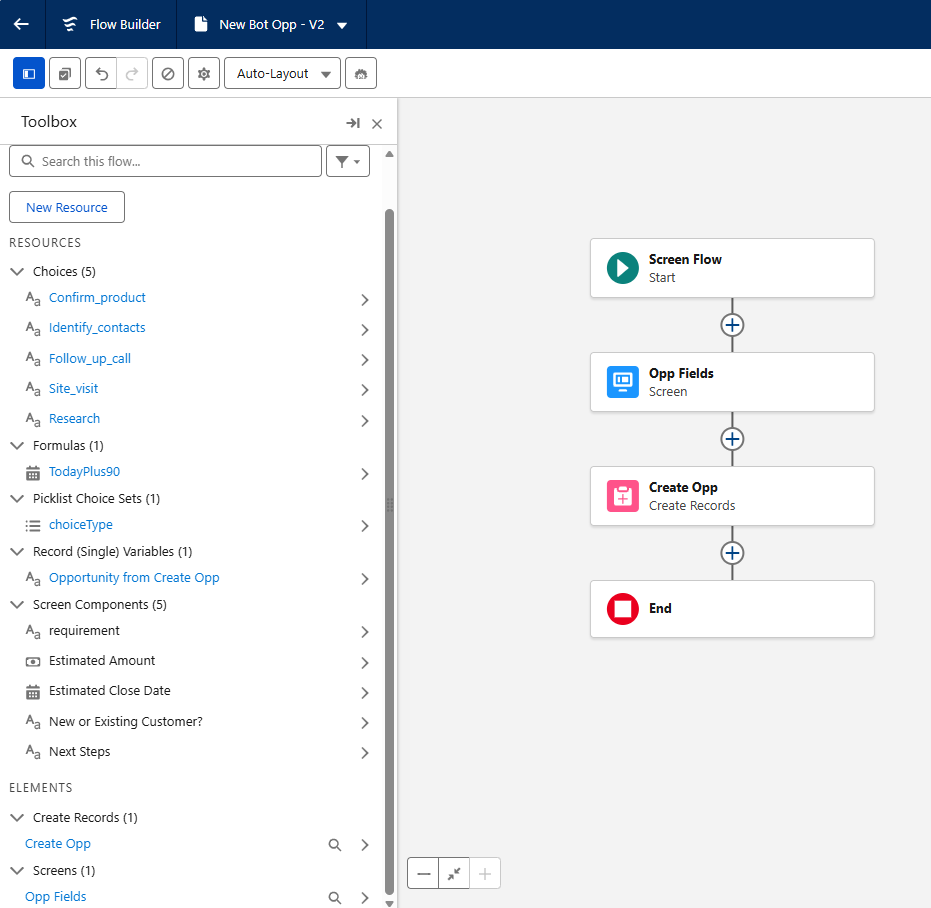
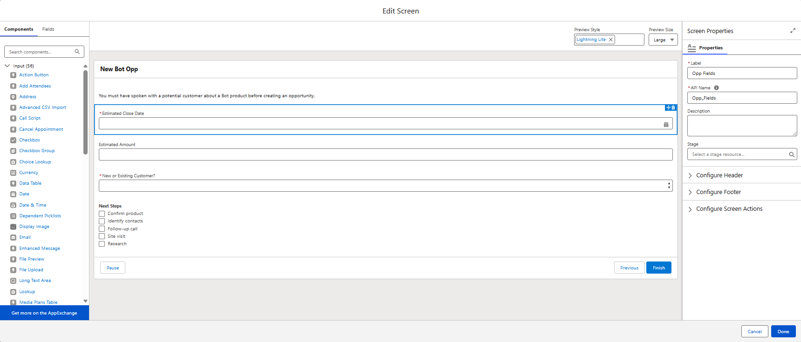
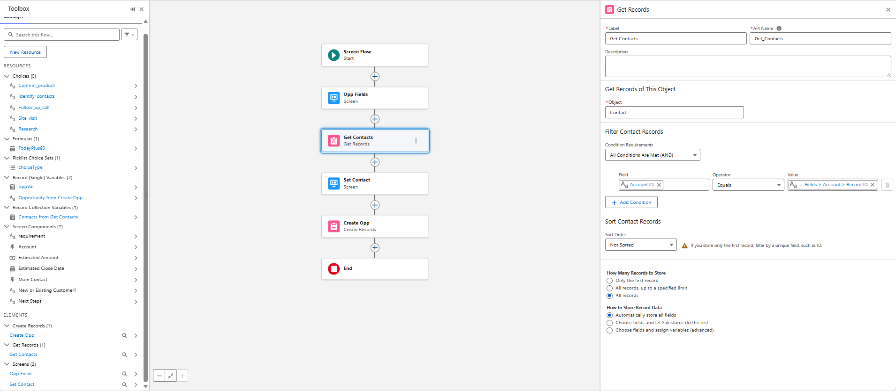
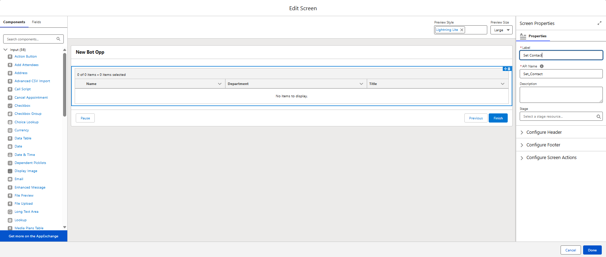
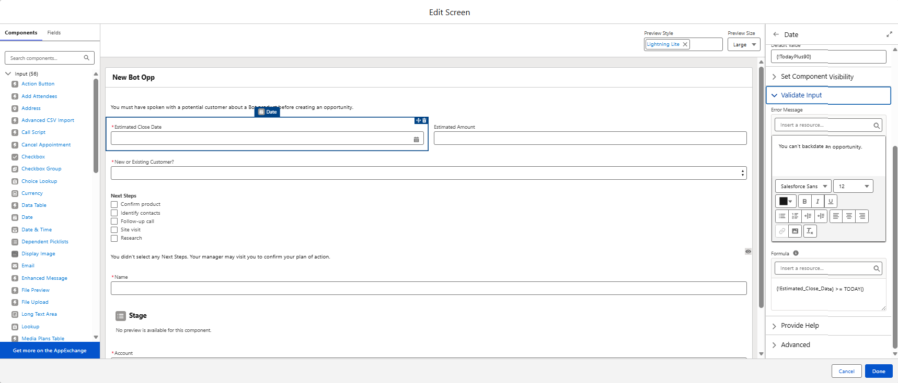
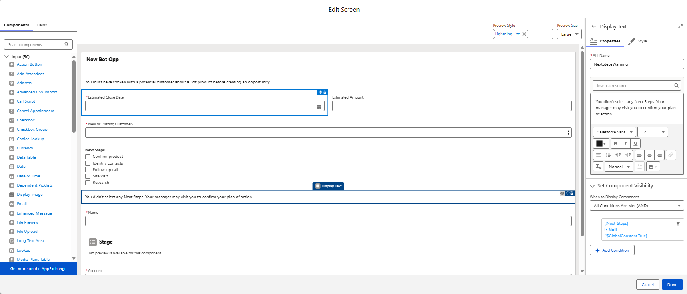

# Screen Flows  

## Get Started with Screen Flows  

### The Power of Interaction  
Screen flows allow Salesforce to interact with users by asking questions and presenting information. Based on user input, flows can update records, send communications, or display follow-up questions. They can be added to Lightning pages or Experience Cloud pages, making them useful for both interaction and automation.

### What Is a Screen?  
A screen is a page shown to users during a flow. It is created using a Screen element and can contain components that display information or collect input. A flow can include multiple screens, creating a multi-step experience. The flow pauses at each screen until the user provides input and clicks **Next**.

### Screen Components  
Screen components fall into three main categories:  
- **Display Components** – Show information to users  
- **Input Components** – Collect user input  
- **Record Fields** – Store user input in record variables  

These components support different data types such as text, dates, and picklists, helping streamline data entry and improve user experience.

### Capture Customer Help Requests with a Screen Flow  
In this scenario, a screen flow is used to collect customer help request details and create a case record. The flow gathers issue descriptions and call outcomes, then maps that input to Salesforce fields.

## Build a Screen Flow  

### Create a Screen Flow and Add a Screen Element  
Screen flows are created in Flow Builder by adding a Screen element to collect user input.

### Add Guiding Text  
Display Text components can be used to guide users or agents through a process. Formatting options help highlight important instructions.

### Add Questions  
Screen flows often include different input components such as text fields, long text areas, and toggles.

### Use the Answers to Create a Case  
User input collected from screens can be used in a **Create Records** element to generate new records.

### Challenge: Build a Screen Flow

#### Skills Demonstrated
- **Screen Flows**
- **User Input Screens**
- **Flow Formulas**
- **Date Calculations**
- **Create Records Element**
- **Opportunity Creation Automation**
- **Interactive Flow Design**

#### Challenge Completion Proof
- ✅ **Screen flow created** to collect Opportunity details from users  
- ✅ **Date formula resource configured** using `TODAY() + 90`  
- ✅ **Display text added** to enforce business requirement messaging  
- ✅ **Required date input component** with dynamic default value  
- ✅ **Currency input component** for Opportunity amount  
- ✅ **Opportunity record created** using user-provided screen values  
- ✅ **Flow saved successfully** (`New_Bot_OppCopy`)  
- 📸 **Screenshots captured**: Screen configuration, formula resource, Create Records setup

    
      
    

## Give Users a Choice

### A Simpler Kind of Question  
Salesforce Flow provides multiple-choice screen components such as Picklist, Radio Buttons, Multi-Select Picklist, and Checkbox Group. These allow users to select one or multiple options, improving data accuracy and user experience.

### The Choice Resources  
Choice resources define the options shown in multiple-choice components. Types include:  
- **Choices** – Manually defined options  
- **Record Choice Sets** – Filtered records from Salesforce  
- **Picklist Choice Sets** – Existing picklist values  
- **Collection Choice Sets** – Record collections  

### Adding and Customizing Questions  
Flows can include both single-select and multi-select questions using different choice resources.

### Updating the Flow  
When new inputs are added, the flow’s **Create Records** element must be updated to store those values.

### Challenge: Create Multiple-Choice Questions

#### Skills Demonstrated
- **Screen Flow Enhancements**
- **Picklist Choice Sets**
- **Checkbox Group Components**
- **Dynamic Field Mapping**
- **User Input Validation**
- **Opportunity Field Automation**

#### Challenge Completion Proof
- ✅ **Picklist component added** for Opportunity Type selection  
- ✅ **Picklist Choice Set created** using Opportunity Type field  
- ✅ **Checkbox Group component added** for Next Steps tracking  
- ✅ **Multiple choice resources configured** for user selections  
- ✅ **Screen inputs mapped** to Opportunity Type and Next Step fields  
- ✅ **Flow saved successfully** with updated screen inputs  
- 📸 **Screenshots captured**: Picklist setup, checkbox choices, Create Records mapping

    
      
    

## Add More Options to Your Screens
### Give Users a More Informed Choice  

The Data Table component in screen flows allows users to view detailed information about records before making a selection. Instead of choosing from only a name, multiple fields such as title, email, and phone number can be displayed. This helps users make accurate and informed decisions.  

A Data Table is added to a screen by configuring the record source, selecting the fields to display as columns, and defining how users select rows.

### Quickly Add Existing Fields with Minimal Configuration  

The Record Field component provides a fast way to place existing object fields onto a screen flow. It automatically inherits most field configurations, which reduces setup time. However, it has limitations. Not all field types are supported, and properties such as requiredness cannot always be changed within the component.  

Picklist and lookup fields can also be added using Record Field components when minimal customization is needed.

### Create a Lookup Field with Different Settings  

The Lookup component offers greater flexibility than the Record Field component for lookup relationships. It can function like a standard lookup field while allowing additional configuration options, such as setting default values and making the field required.  

This component is useful when more control over the lookup behavior is needed in the flow screen.

### Allow Users to Upload Files  

The File Upload component enables users to attach files directly to records during a flow. This is commonly used in support or service scenarios where documents or screenshots must be linked to a record such as a case.  

The component must be configured with the correct record ID so uploaded files are associated with the intended record.

### Challenge: Add More Screen Components

#### Skills Demonstrated
- **Record Variables**
- **Record Field Screen Components**
- **Lookup Screen Components**
- **Get Records Element**
- **Data Table Components**
- **User-Driven Record Selection**
- **Advanced Screen Flow Design**

#### Challenge Completion Proof
- ✅ **Record variable created** for Opportunity (`oppVar`)  
- ✅ **Opportunity Name and Stage fields added** to screen via record variable  
- ✅ **Lookup component configured** to select related Account  
- ✅ **Related Contacts retrieved dynamically** using Get Records  
- ✅ **Data Table component added** for single-contact selection  
- ✅ **Selected Contact linked** to Opportunity during record creation  
- ✅ **Opportunity record created** using combined screen and lookup inputs  
- 📸 **Screenshots captured**: Record variable setup, lookup component, data table configuration

    
      
    

## Improve the Look and Feel of Your Screens
### Set a Screen’s Footer Buttons  
Flow screen footer buttons can be customized to improve usability and reduce user errors. Unnecessary buttons can be hidden, and labels can be made more descriptive. For example, the **Previous** button can be removed on certain screens to prevent navigation issues, and the **Next** button can be renamed to something action-oriented like **Create Case**. This helps guide users clearly through the process and reduces mistakes such as duplicate record creation.

### Organize Components into Rows and Columns  
Flow screens can be structured into multiple columns using the **Section** component. This layout allows components to be arranged side by side instead of stacked vertically. Organizing screens this way reduces scrolling and makes forms easier to read and complete, especially when many fields are present.

### Control When Components Appear  
Conditional visibility allows components to appear only when specific conditions are met. This ensures users see only the fields that are relevant to their input. For example, follow-up time slot fields can be shown only if the selected case reason requires follow-up. This keeps screens simpler and improves user experience.

### Improve Data Quality in Components  
Validation rules can be applied to screen components to enforce better data entry. Requirements such as a minimum character count in a description field encourage users to provide detailed information. Users cannot proceed until the entered data meets the defined criteria, helping maintain data quality.

### Challenge: Add Guidance to Your Flow

#### Skills Demonstrated
- **Screen Flow Validation Rules**
- **Formula-Based Input Validation**
- **Dynamic Component Visibility**
- **User Guidance Messaging**
- **Conditional Screen Logic**
- **Interactive UX in Flows**

#### Challenge Completion Proof
- ✅ **Input validation added** to prevent backdating Opportunity close date  
- ✅ **Validation formula implemented** using date comparison with `TODAY()`  
- ✅ **Dynamic warning message added** below Next Steps component  
- ✅ **Conditional visibility configured** based on user selection  
- ✅ **User guidance improves data quality and completeness**  
- ✅ **Flow saved and activated successfully**  
- 📸 **Screenshots captured**: Validation formula, display text visibility rules, updated screen layout
    
      
    
