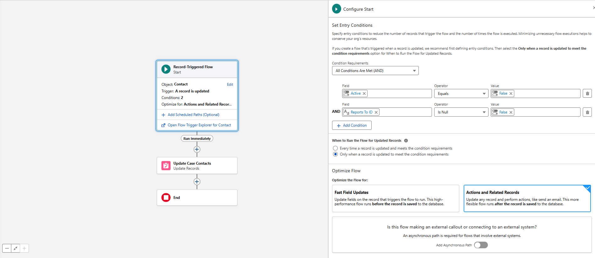
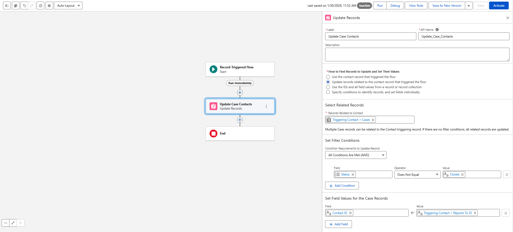
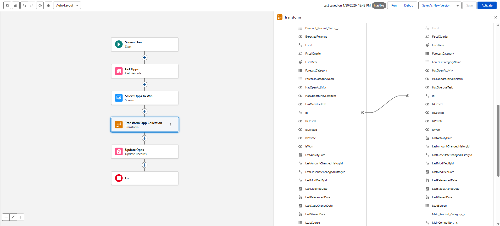
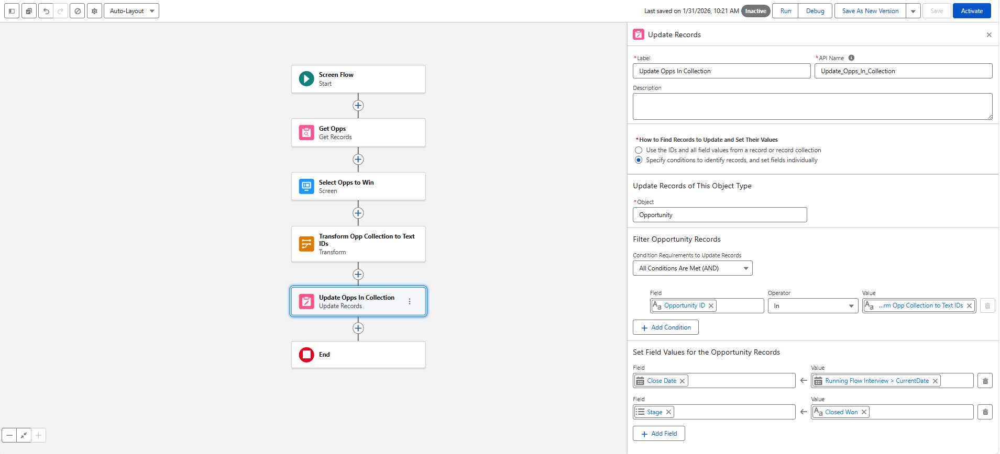
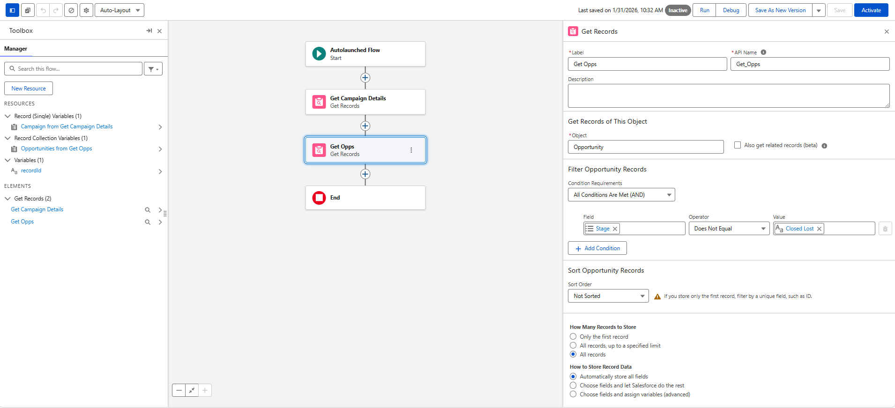
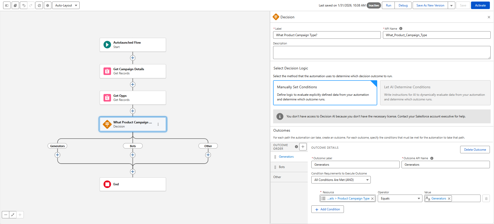
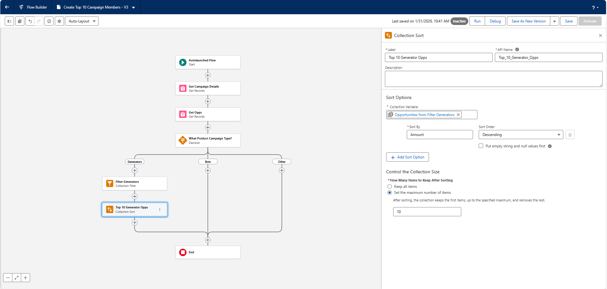
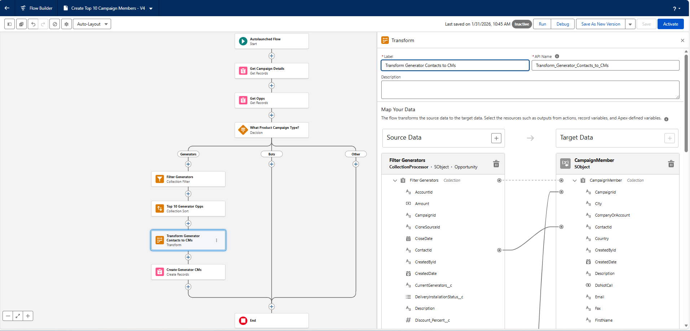
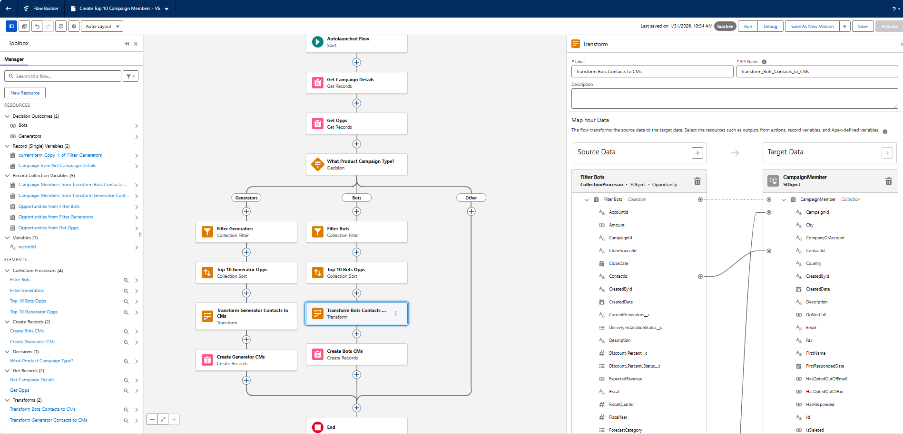

# Multirecord Elements and Transforms in Flows

## Update and Retrieve Multiple Records
### Update Multiple Records from a Triggered Record Change  
Record-triggered flows can update multiple related records automatically when a specific change occurs. For example, when an opportunity is marked as lost, related cases can be closed using the **Update Related Records** option in the **Update Records** element. This ensures that only relevant records are modified and prevents unnecessary updates.

### Retrieve Multiple Records  
The **Get Records** element can retrieve multiple records and store them in a collection variable. A collection variable holds several records or values of the same data type, making it useful when a flow needs to work with groups of related records.

### Create a Collection Variable with a Get Records Element  
A collection variable can be created by configuring the **Get Records** element to store all retrieved records. This approach supports use cases such as updating multiple onboarding project steps at once, allowing several related records to be managed and updated within a single flow.

### Challenge: Update Cases When Contact Becomes Inactive
#### Skills Demonstrated
- **Record-Triggered Flows**
- **Related Record Updates**
- **Conditional Flow Execution**
- **Cross-Object Field Mapping**
- **Case Management Automation**
- **Contact Hierarchy Logic**

#### Challenge Completion Proof
- ✅ **Record-triggered flow created** on Contact updates  
- ✅ **Entry conditions configured** for inactive contacts with a Reports To value  
- ✅ **Execution restricted** to only when conditions are newly met  
- ✅ **Related Case records targeted** via Contact–Case relationship  
- ✅ **Open cases reassigned automatically** using Reports To ID  
- ✅ **Closed cases excluded** through filter logic  
- ✅ **Flow saved successfully** (`Update_Cases_When_Contact_Becomes_Inactive`)  
- 📸 **Screenshots captured**: Entry criteria, related record update setup, field mapping

    
      
    

## Transform Multiple Records
### Transforms vs. Loops  
Flow Builder provides two elements for working with multiple records: **Transform** and **Loop**. The Transform element is designed to apply similar changes to many records efficiently. The Loop element processes records one at a time, which can take longer and may increase the risk of hitting system limits. Using Transform is considered best practice when the same type of update needs to be applied across a collection of records because it performs better and scales more effectively.

### Capture Record Selections with a Data Table  
A screen flow can use a **Data Table** component to let users select multiple records at once. The selected rows become a collection that can be used in later flow elements. This setup often includes an additional input component, such as a picklist, so users can choose a new value (for example, a status) to apply to all selected records.

### The Transform Element  
The Transform element converts selected records or other data into a new collection that can be used by elements like **Update Records**. It allows field mapping from source data to target data and supports applying formulas or static values during the transformation. This makes it possible to reshape and prepare data before it is updated.

### Update Records with Transform  
After data is transformed, an **Update Records** element is used to apply the new values to all selected records at once. This method ensures efficient bulk updates. An alternative approach using a text collection is also possible and is introduced as another way to achieve similar results.

### Challenge: Define Transform Formulas to Set Multiple Opportunities to Closed Won

#### Skills Demonstrated
- **Flow Transform Elements**
- **Collection Variable Handling**
- **Formula-Based Field Updates**
- **Bulk Record Updates**
- **Opportunity Stage Automation**
- **Advanced Flow Data Mapping**

#### Challenge Completion Proof
- ✅ **Transform element added** to process selected Opportunity collection  
- ✅ **Source-to-target field mapping configured** for Opportunity IDs  
- ✅ **Formula applied** to set Close Date using `TODAY()`  
- ✅ **Stage automatically set** to *Closed Won* for all selected records  
- ✅ **Bulk update performed** using transformed Opportunity collection  
- ✅ **Flow saved successfully** with updated automation logic  
- 📸 **Screenshots captured**: Transform configuration, formula setup, Update Records mapping

    

## Transform Data From One Form to Another

### Transform a Collection into a Different Type of Collection  
The Transform element in Flow Builder can convert one type of collection into another. A common use case is transforming a record collection into a text collection. A text collection stores text values such as record IDs. These IDs can then be used with the **Update Records** element and the **In** operator, which filters records whose field values match items in the text collection. This enables efficient bulk updates.

### Map the ID from Source to Target  
The Transform element is configured by selecting the source collection and defining the target collection type as text. Record IDs from the source collection are mapped to the target text collection. This mapping ensures that each record ID is captured as a text value that can be referenced later in the flow.

### Update Records Using the Transformed Collection  
An **Update Records** element can use the transformed text collection to filter which records should be modified. By applying the **In** operator with the text collection of IDs, the flow updates only the records that match those IDs, completing the automation process.

### Challenge: Transform Opportunity IDs Into a Text Collection

#### Skills Demonstrated
- **Transform Elements**
- **Collection-to-Text Conversion**
- **Flow Data Type Handling**
- **Bulk Record Updates**
- **IN Operator Usage**
- **Opportunity Stage Automation**
- **Advanced Flow Filtering**

#### Challenge Completion Proof
- ✅ **Transform element used** to convert Opportunity record collection to text ID collection  
- ✅ **Opportunity IDs mapped** from selected rows into text collection variable  
- ✅ **Update Records configured** using **IN operator** with ID collection  
- ✅ **Multiple Opportunities updated simultaneously**  
- ✅ **Close Date set dynamically** using current interview date  
- ✅ **Stage updated automatically** to *Closed Won*  
- ✅ **Flow saved successfully** with collection-based update logic  
- 📸 **Screenshots captured**: Transform mapping, IN filter setup, Update Records configuration

    

## Organize Data in a Collection Variable

### Filtering a Collection  
The **Collection Filter** element is used to apply criteria to a collection and create a new collection containing only matching records or values. The original collection remains unchanged, which is helpful when both filtered and unfiltered data are needed. For example, a list of email addresses can be filtered to exclude addresses from a competitor’s domain.

### Sorting and Truncating a Collection  
The **Collection Sort** element reorders items in a collection based on selected criteria, such as sorting opportunities by amount in descending order. It can also limit the collection to a specific number of items, such as keeping only the top 10 records. Unlike filtering, sorting directly modifies the collection being sorted.

### Using Filter and Sort in a Flow  
Filtering and sorting can be combined to meet more complex requirements. A flow can first filter records based on certain conditions, such as product type, and then sort the results to identify the highest-value records. These elements are particularly useful when conditions are dynamic and based on user input or decisions made earlier in the flow.

### Transforming and Creating Records  
After collections are filtered and sorted, the data can be transformed into a different structure and used to create new records. For example, filtered records can be transformed into campaign members before being created. This approach avoids loops and supports more efficient flow design.

### Challenge: Create Campaign Members from Filtered and Sorted Opportunity Contacts

#### Skills Demonstrated
- **Collection Filter Elements**
- **Collection Sort Elements**
- **Transform Elements**
- **Campaign Member Automation**
- **Bulk Record Creation**
- **Flow Collection Processing**
- **Opportunity-to-Campaign Data Mapping**

#### Challenge Completion Proof
- ✅ **Opportunity collection filtered** for Main Product Category = *BT*  
- ✅ **Filtered opportunities sorted** by Amount in descending order  
- ✅ **Top 10 records retained** using collection limit  
- ✅ **Contacts transformed into Campaign Member records**  
- ✅ **Campaign ID assigned dynamically** via formula mapping  
- ✅ **Campaign Members created in bulk** from transformed collection  
- ✅ **Flow saved successfully** with Bots path logic completed  
- 📸 **Screenshots captured**: All versions of the Flow growing in each step

    
     
    
     
    
     
    
     
    