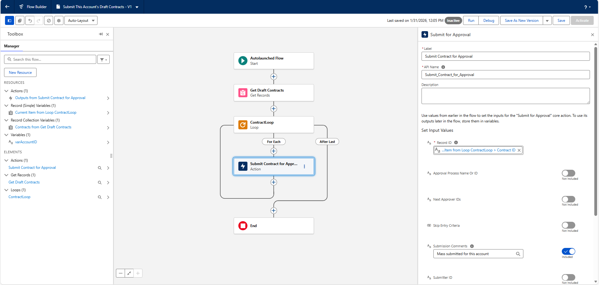
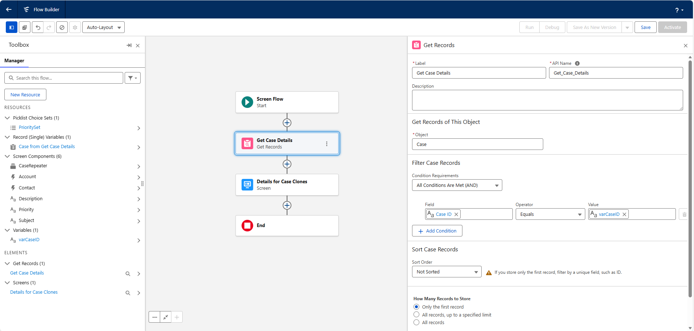
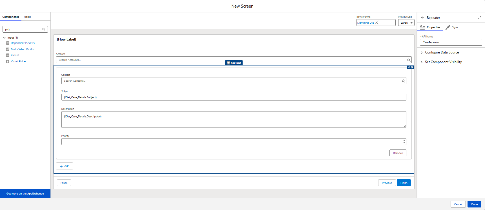
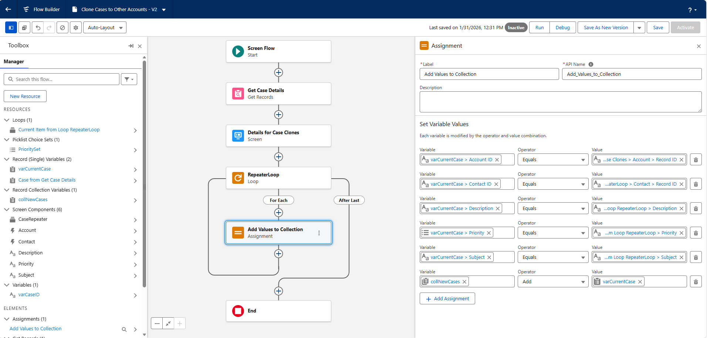
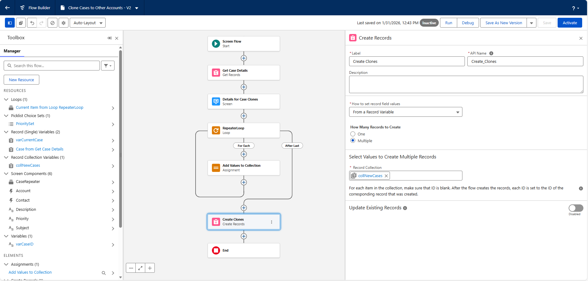

# Loops in Flow Builder

## Know When to Loop

### Get In the Loop About Loops  
The **Loop** element in Flow Builder processes items in a collection one at a time. This differs from the **Transform** element, which handles collections in bulk. Loops are useful when specific actions or decisions must be applied to each individual record, such as locking records or posting updates to Chatter feeds.

### Loops Without a Loop Element  
Manual loops can be created by connecting elements in a circular path within a flow. However, this approach is riskier because it can lead to infinite loops and lacks built-in optimization. Manual looping should only be considered when neither the Transform nor Loop elements can be used, such as when working with data that is not stored in a collection.

### Avoid Nested Loops  
Nested loops occur when one loop runs inside another. This can quickly consume CPU time because the number of element executions increases rapidly. Nested loops should be avoided unless working with a very small data set.

### Best Practices  
The **Transform** element is preferred for efficiency when making similar updates to multiple records. The **Loop** element is appropriate when individual processing or decisions are required for each item. Manual loops should be used only as a last option, and nested loops should be avoided to prevent performance and limit issues.

## Build a Loop

### Use Actions in a Loop  
A scheduled flow can automate actions on records at a set time. One example is retrieving opportunities that were closed 7 days ago, locking those records, and posting updates to their Chatter feeds. This process involves configuring a schedule-triggered flow, using a **Get Records** element to collect the opportunities, and a **Loop** element to process each one individually.

### Update Multiple Records with a Loop  
Data operations such as **Get Records**, **Create Records**, **Update Records**, or **Delete Records** should not be placed inside a loop. Doing so can exceed Salesforce governor limits. Instead, records should be retrieved before the loop, processed during the loop, and updated after the loop. A typical use case is identifying users inactive for a certain period, preparing updates in a collection variable, and committing the changes in a single step.

### Create a Scheduled Flow and Its Formulas  
Scheduled flows can be configured to run daily. Formula resources can calculate dates such as 25 days ago or 30 days ago for filtering records. A **Get Records** element retrieves active users based on those date criteria, and a **Loop** element processes each record in the resulting collection.

### Commit Changes to the Records with an Update Records Element  
After all records are processed in a loop, the updates stored in a collection variable are applied using a single **Update Records** element. This method ensures efficient bulk updates and helps stay within system limits.

### Challenge: Loop Multiple Records Through an Action

#### Skills Demonstrated
- **Autolaunched Flows**
- **Loop Elements**
- **Flow Actions**
- **Submit for Approval Automation**
- **Collection Processing**
- **Contract Lifecycle Automation**
- **Account-Based Record Filtering**

#### Challenge Completion Proof
- ✅ **Autolaunched flow created** with Account ID input variable  
- ✅ **Draft contracts retrieved** using Get Records with multiple conditions  
- ✅ **Loop element implemented** to process contract collection  
- ✅ **Submit for Approval action executed** for each contract  
- ✅ **Dynamic record referencing used** within loop iteration  
- ✅ **Flow saved successfully** (`Submit_This_Account_s_Draft_Contracts`)  
- 📸 **Screenshots captured**: Get Records filter, Loop configuration, Submit for Approval action

    

## Create and Update Records With a Repeater

### Perform Multiple Data Actions on One Screen with a Repeater  
The **Repeater** screen component allows multiple records to be created or updated from a single screen. It enables users to dynamically add groups of fields by selecting an **Add** option. This is useful in scenarios such as entering or updating contact details during meetings, where several records need to be handled at once.

### Create a Screen Flow and Get Existing Contacts  
A screen flow can begin by storing the current account’s ID in a variable. A **Get Records** element then retrieves existing contacts related to that account. This setup ensures the flow has access to existing data for display and updates.

### Create a Screen with Repeating Fields  
A screen can include a Repeater component containing fields such as Name, Title, Email, and Phone. These fields are placed inside the Repeater so users can enter multiple contact records in one interface. The configuration allows the screen to handle both new and existing records.

### Configure Default Field Values for Existing Records  
Existing contact data can be displayed in the Repeater by mapping fields to the records retrieved earlier. Default field values are set using the **Repeater Prepopulated Items** configuration. This allows users to view and edit existing records directly within the repeating field structure.

### Challenge: Add a Repeater to a Screen Flow

#### Skills Demonstrated
- **Screen Flows**
- **Repeater Components**
- **Dynamic Record Cloning**
- **Lookup Screen Components**
- **Picklist Choice Sets**
- **Flow Collection Input**
- **Case Management Automation**

#### Challenge Completion Proof
- ✅ **Screen flow created** to clone cases to other accounts  
- ✅ **Input variable configured** to receive source Case ID  
- ✅ **Original Case details retrieved** using Get Records  
- ✅ **Lookup component added** to select target Account  
- ✅ **Repeater component implemented** for multiple Case creation entries  
- ✅ **Case fields prefilled dynamically** (Subject, Description)  
- ✅ **Priority picklist configured** using Case picklist choice set  
- ✅ **Flow saved successfully** (`Clone_Cases_to_Other_Accounts`)  
- 📸 **Screenshots captured**: Repeater setup, lookup fields, dynamic default values

    
     
    

## Loop Through a Repeater

### Loop to Modify Records and Add Them to a Collection  
Data entered through a Repeater component can be organized into a record collection variable using a **Loop** element and an **Assignment** element. Repeater data can be grouped as Added Items, Prepopulated Items, Deleted Items, or All Items, depending on the use case. Selecting **All Items** allows every entry from the repeater to be processed and structured into a collection for further actions in the flow.

### Upsert the New and Changed Contact Collection  
An **upsert** combines inserting new records and updating existing ones in a single operation. In Flow Builder, this can be done using a **Create Records** element with the **Update Existing Records** option enabled. A unique identifier, such as a Record ID, is required to determine whether a record should be updated or created.

### Final Steps and Testing  
The completed flow can be added as a custom action on a Lightning page for testing. When launched, the flow displays existing contacts for an account and allows users to add or modify contact details. This process demonstrates practical use of loops, collections, and record operations within Flow Builder.

### Challenge: Loop Through a Screen’s Repeater

#### Skills Demonstrated
- **Loop Elements**
- **Assignment Elements**
- **Record Collection Variables**
- **Screen Repeater Processing**
- **Bulk Record Creation**
- **Flow Data Structuring**
- **Case Automation**

#### Challenge Completion Proof
- ✅ **Record and record collection variables created** for Case processing  
- ✅ **Repeater collection looped** to handle multiple user entries  
- ✅ **Assignment element used** to map repeater inputs into a Case record variable  
- ✅ **Case records aggregated** into a collection variable  
- ✅ **Bulk case creation performed** using collection-based Create Records  
- ✅ **Flow saved successfully** with repeater data processing logic  
- 📸 **Screenshots captured**: Loop setup, assignment mappings, collection-based record creation

    
     
    