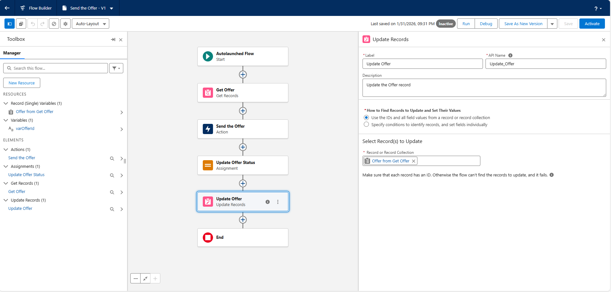
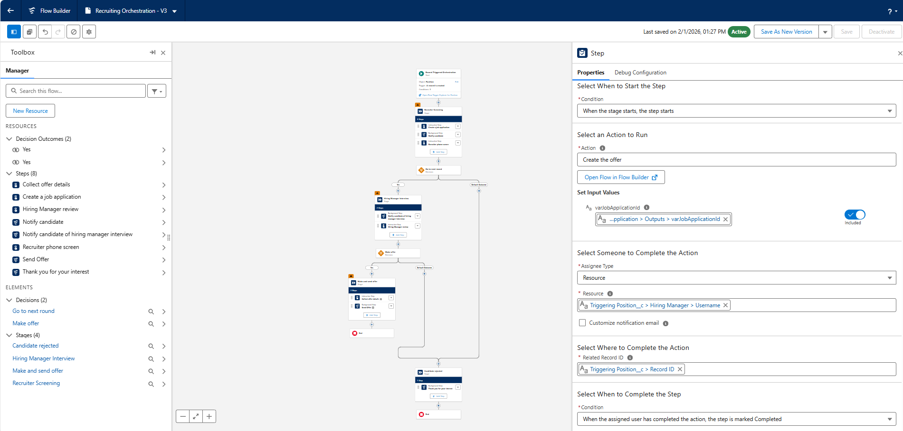

# Orchestrate Complex Processes with Flow Orchestration

## Identify Business Uses for Flow Orchestration

### Quick Review  
Flow Orchestration in Salesforce combines automated processes into a single coordinated workflow. It organizes work into stages and steps, supporting structured approval processes, task assignments, and record lifecycle management.   
With Flow Orchestration, you can:
- Coordinate step-by-step activities.
- Show team members where handoffs occur.
- Support parallel workstreams.
- Combine automated actions and manual work items.
- Monitor a process and its associated work items.

### Orchestration Types  
Flow Orchestration includes two main types:

- **Record-Triggered**: Runs automatically when a specified record is created or updated.  
- **Autolaunched**: Started through a custom Apex class, REST API, or a custom URL.  

Orchestrations are structured using:
- **Stages** – Groups of related actions  
- **Steps** – Interactive tasks or background processes and all steps require a flow in order to run.
- **Flows** – Screen flows or autolaunched flows  

Interactive steps generate work items assigned to users, which are completed in the Orchestration Work Guide.

### Benefits  
Flow Orchestration improves efficiency by reducing delays in task completion. It minimizes errors by automating task routing and assignments. Monitoring tools provide visibility into progress, helping teams identify issues early and keep processes moving smoothly. This leads to better accuracy and time savings.

### Use Cases  
Flow Orchestration supports complex processes involving multiple roles, such as incident management, sales cycles, and mortgage approvals. It enables parallel work and smooth handoffs between teams, making it well-suited for cross-functional business workflows.

## Plan an Orchestration

### Where to Begin  
Before building a Flow Orchestration, the business process should be carefully planned. Creating a flowchart of the entire process helps identify which steps can be automated, which flows need to be built, and whether any third-party system integrations are required. This planning stage also clarifies which actions require user input and which can run automatically in the background.

### Design Considerations  
Designing an orchestration involves defining how the process starts and ends, identifying the roles of users or groups involved, and outlining the tasks assigned to each. Conditional paths, pauses, and performance optimizations should be considered to avoid unnecessary processing. Planning for maintenance and future changes is important, and reviewing existing flows can help determine whether they can be reused within the orchestration.

## Identify Your Steps and Build Your Flows

### Steps in the Process 
A process in Flow Orchestration is organized into steps, which can run sequentially or concurrently. Steps are categorized as either **interactive** or **background**. Interactive steps require user input, while background steps run automatically without user involvement. Examples of steps include creating job applications, scheduling interviews, and sending rejection emails. Each step can be assigned to specific users, groups, queues, or resources.

### Stages in the Process
Stages group related steps together and always run in sequence. Only one stage can be active at a time. A process might be divided into stages such as Initial Screening, Hiring Manager Interview, and Candidate Rejected. Decision elements determine the path within a stage and control how the process progresses from one stage to another.

### Building Flows 
Flows are the building blocks of orchestration and should be designed for reuse. Screen flows are used for user interactions, autolaunched flows handle automated actions, and email alerts manage notifications. Flows should be activated and properly documented to support clarity, maintenance, and future updates.

### Challenge: Build the Email the Offer Flow
#### Skills Demonstrated
- **Autolaunched Flows**
- **Flow Input Variables**
- **Get Records Element**
- **Email Actions**
- **Assignment Elements**
- **Record Updates via Flow**
- **Recruiting Process Automation**

#### Challenge Completion Proof
- ✅ **Autolaunched flow created** for Recruiting Orchestration  
- ✅ **Offer ID input variable configured** for external invocation  
- ✅ **Offer record retrieved dynamically** using Get Records  
- ✅ **Email action configured** to send offer details to candidate  
- ✅ **Dynamic salary merge field used** in email body  
- ✅ **Offer status updated** via Assignment element  
- ✅ **Offer record updated** using Update Records element  
- ✅ **Flow saved and activated successfully** (`Send_the_Offer`)  
- 📸 **Screenshots captured**: Input variable, Get Records setup, email action, status update
    
    

## Build the Orchestration

### Building the Orchestration  
Creating a flow orchestration begins with building the required flows, identifying the steps and stages of the business process, and then assembling them into an orchestration. The orchestration can be configured to start automatically when a record is created, with conditions that control when it runs, such as checking specific field values.

### Adding Stages and Steps  
Stages are added to represent major phases of the process, such as Recruiter Screening. Within each stage, steps are configured to perform specific actions like creating a job application, scheduling a phone screen, and conducting the screen. Each step includes defined actions, input values, and assigned users or groups to ensure the process runs smoothly.

### Decisions and Additional Stages  
Decision elements control how the orchestration progresses based on conditions, such as candidate evaluation scores. Depending on the outcome, the process can move to different stages like Hiring Manager Interview or Candidate Rejected. Each stage contains its own steps and actions tailored to that path.

### Activating the Orchestration  
Once the orchestration is complete, it is saved and activated. Only one version of an orchestration can be active at a time, ensuring that the most current configuration is used. Assigning steps to groups rather than individuals helps prevent bottlenecks and keeps the process moving efficiently.

### Challenge: Add the Create and Email Offer Stage
#### Skills Demonstrated
- **Flow Orchestration**
- **Orchestration Stages and Steps**
- **Interactive Steps**
- **Background Steps**
- **Subflow Integration**
- **Flow Input/Output Mapping**
- **Recruiting Process Automation**

#### Challenge Completion Proof
- ✅ **New orchestration stage added** for offer creation and delivery  
- ✅ **Interactive step configured** to collect offer details via screen flow  
- ✅ **Hiring Manager assigned dynamically** as step assignee  
- ✅ **Related record context passed** using Position record ID  
- ✅ **Background step added** to trigger offer email flow  
- ✅ **Flow outputs mapped** to pass Offer ID between steps  
- ✅ **New orchestration version saved and activated**  
- 📸 **Screenshots captured**: Stage setup, interactive step config, background step, input/output mapping

    

## Run and Monitor the Orchestration

### Run the Orchestration  
Running an orchestration generates work items that move a business process forward. For example, a recruiting process can begin by creating a new position, assigning candidates, and progressing through recruiter and hiring manager evaluations as each step is completed.

### Monitor Orchestration Runs  
Administrators can track orchestrations using the **Orchestration Runs** tab. Run statuses such as Not Started, Started, Completed, Canceled, or Error provide visibility into progress. Monitoring run history and execution cycles helps identify bottlenecks and improve overall performance.

### Cancel and Debug Orchestrations  
Running orchestrations can be canceled if they are no longer required. Debugging tools provide insight into active runs by showing variable values and the path taken through the orchestration. This helps diagnose issues and understand how the process is executing.

### Orchestration Work Items  
Interactive steps generate work items that are assigned to users, groups, or queues. These work items appear in the **Orchestration Work Items** tab, where users can view, manage, and complete their assigned tasks to keep the process moving forward.
