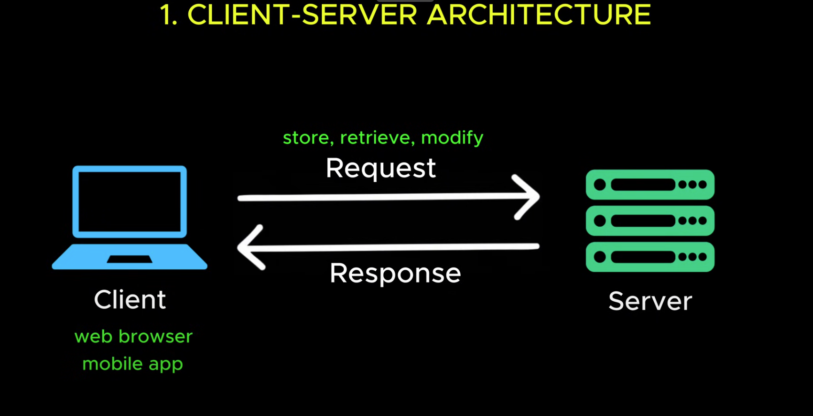
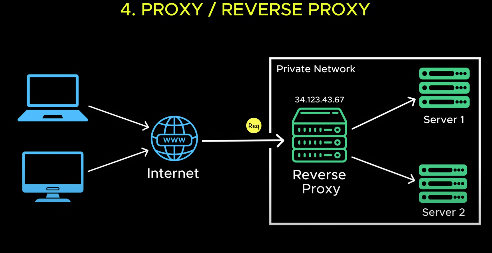
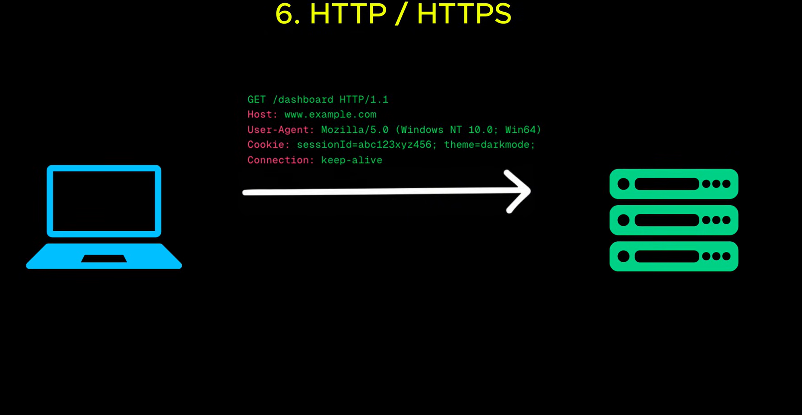

# System Design Basic Concepts
## Glossary
1. [Client-Server Architecture](#client-server-architecture)
2. [IP Address](#ip-address)
3. [DNS](#dns)
4. [Proxy/Reverse Proxy](#proxy-reverse-proxy)
5. [Latency](#latency)
6. [HTTP/HTTPS](#http-https)
7. [APIs](#apis-application-programming-interfaces)
8. [Rest API](#rest-api)
9. [GraphQL](#graphql)
10. [Databases](#databases)
11. [SQL vs NoSQL](#sql-vs-nosql)
12. [Vertical Scaling](#vertical-scaling)
13. [Horizontal Scaling](#horizontal-scaling)
14. [Load Balancers](#load-balancers)
15. [Database Indexing](#database-indexing)
16. [Replication](#replication)
17. [Sharding](#sharding)
18. [Vertical Partitioning](#vertical-partitioning)
19. [Caching](#caching)
20. [Denormalization](#denormalization)
21. [CAP Theorem](#cap-theorem)
22. [Blob Storage](#blob-storage)
23. [CDN](#cdn)
24. [WebSockets](#websockets)
25. [Webhooks](#webhooks) 
26. [Microservices](#microservices)
27. [Message Queues](#message-queues)
28. [Rate Limiting](#rate-limiting)
29. [API Gateways](#api-gateways)
30. [Idempotency](#idempotency)

## Client-Server Architecture
A client server architecture comprises of a client and a server.  
Client could be a web browser or a mobile app.  
Server is a machine that runs continously waiting to handle any incoming requests.  
Client sends a request to store, retrieve or modify data on the server.  
Server then processes the request and sends a response back to the client.  

</img>

## IP Address
Computers identify each other on the internet using IP Addresses (they kind of act as phone numbers).  
Every publically deployed server has a unique IP addresses.(For example - 34.120.10.5)  
A client needs to send a request to that IP address.

## DNS (Domain Name System)
A DNS Server maps easy to remember domain names to thier corresponding IP Addresses.  
When a client sends a request it first goes through the DNS Server, fetches the IP Address and this IP address is then used to communicate with the actual server.

</img>

## Proxy/Reverse Proxy
A proxy server (__on the client side__) acts as a middleman between the client and the server.  
When a client sends a request to the server, the proxy server processes the request and sends it to the actual server.  
The proxy server hides the actual IP Address of the Client keeping location and identity private.

</img>

A reverse proxy server (__on the server side__) takes the request from the client and forwards it to the respective server based on some predefined rules.  

</img>

## Latency
Latency is the round trip delay caused due to the distance between the server and client.  
It is directly proportional to the distance between the server and client.  
High latency can make applications feel slow and unresponsive.
One way to reduce latency is to deploy servers accross multiple data centers worldwide.  

## HTTP/HTTPS
The client and server communicate using a set of rules called HTTP (_Hyper Text Transfer Protocol_) or a secured version called HTTPS (_Hyper Text Transfer Protocol Secure_).  
The request contians a header containing details like the request type, browser type and cookies.  
It sometimes also contains the body which carries additional data like form inputs.  
The server then processes this request and sends a HTTP Response either with the requested data or an error message.  
HTTP has a major security flaw, it sends data in plain text.  
HTTPS encrypts all data using SSL or TLS protocol.  

</img>

## APIs (_Application Programming Interfaces_)
An API act as a middleman without having to worry about the low level details.  
The client sends a request to the API which sends it to the server for further processing and returns a response in a structured format usually a JSON or XML.  
There are two styles of API most widely used are REST and GraphQL.  

## Rest API
REST defines how client and server communicate over HTTP in a structured way.
REST is stateless, i.e. every request is independent.  
REST requests are easy to cache.
It uses standard HTTP Methods like GET, POST, PUT, DELETE.
REST endpoints often retrieve more data than needed, leading to inefficient network usage.

## GraphQL
In GraphQL the server responds only with the data for the requested fields.  
However, GraphQL requires more processing on the server side and isn't easy ot cache as REST.

## Databases
Database is the backbone of any modern application.  
It ensures that the data is stored, retrieved and managed efficiently while keeping it secure, consistent and durable.

## SQL vs NoSQL
__SQL Databases__ store data in tables with a __strict predefined schema__ and they follow __ACID properties__.  
They are __ideal for__ applications that require __strong consistency and structured relationships__ such as banking systems.  
NOSQL Databases are designed for __High Scalability__ and __Performance__ with a __flexible schema__.
They use different __data models__ such as key-value stores, docuemnt stores, graph databases and wide column stores (which are optimised for large scale distributed data).  

## Vertical Scaling
Vertical Scaling is upgrading the current system by adding more CPU, RAM and Storage.
Each server has a maximum limit till which it can be scaled up.  
More powerful servers become exponentially more expensive.
If this server crashes the entire system crashes.

## Horizontal Scaling

## Load Balancers
## Database Indexing
## Replication
## Sharding
## Vertical Partitioning
## Caching
## Denormalization
## CAP Theorem
## Blob Storage
## CDN
## WebSockets
## Webhooks
## Microservices
## Message Queues
## Rate Limiting
## API Gateways
## Idempotency